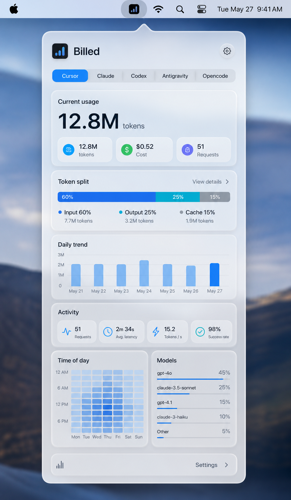

# 06 — Design Source of Truth

This document is the visual design source of truth for Billed. Use it when
adding or reviewing UI work. The older UI spec describes product behavior; this
document describes the intended look, hierarchy, and interaction feel.

Reference concept:

## Product Feel

Billed should feel like a native macOS menu bar instrument: compact, calm,
premium, and glanceable. It is not a marketing surface and not a full analytics
app. The panel should answer three questions quickly:

1. Which provider am I viewing?
2. How much usage happened in this range?
3. What changed across time, activity, and models?

The target aesthetic is the reference image above: an Apple-inspired Liquid
Glass menu popover with translucent layered surfaces, rounded glass cards,
crisp typography, and strong blue accent selection. The image is the visual
authority when this document and the mockup differ.

## Layout

The primary surface is a floating menu bar panel.

- Target width: 380-430 pt.
- Minimum practical height: 620 pt.
- Corner radius: 10-14 pt for the outer panel, 8 pt for internal surfaces.
- Padding: 16 pt horizontal page padding, 10-14 pt vertical section spacing.
- Scrolling: content scrolls under a fixed-feeling header and footer.

Top-to-bottom structure:

1. Billed app header
2. Provider tabs
3. Range selector and refresh
4. Hero usage summary with three chips
5. Supporting metric cards
6. Token split with detail affordance
7. Daily trend
8. Activity metric chips
9. Time of day and Models side-by-side
10. Footer utility row

## Header

The header establishes context and should be visible at first glance.

- Show the Billed app badge.
- Show `Billed` as the title.
- Show last updated or cached state below the title.
- Put Settings at the top right as a circular glass icon button.
- Put refresh with the range selector below provider tabs.
- Use a macOS material-like surface. Keep the header visually distinct from
  scroll content.

Provider badge:

- Size: 34 x 34 pt.
- Shape: rounded rectangle, radius 8 pt.
- Fill: accent color at low opacity.
- Icon: `chart.bar.fill` with blue/cyan treatment on a dark rounded square.

## Provider Tabs

Provider tabs are a single compact segmented glass strip.

- Show provider display names.
- Active tab uses solid system accent blue with white text.
- Inactive available tabs sit directly on the translucent strip.
- Disabled providers are dimmed, but still understandable.
- Missing providers are tertiary and disabled.
- Keep tab labels one line.

Supported providers:

- Cursor
- Claude
- Codex
- Antigravity
- Opencode

## Range Selector

The range selector remains a native segmented control.

- Options come from `UsageRange.allCases`.
- It sits below provider tabs.
- It should span the panel width.
- Changing range updates the menu bar metric and all dashboard sections.

## Hero Usage Summary

The hero summary is the first large glass card in the panel.

Content:

- Eyebrow: `Current usage`
- Primary number: compact total tokens, e.g. `12.8M`
- Unit label: `tokens`
- Summary chips: tokens, cost, and request count

Style:

- Use large rounded/tabular numerals.
- Background uses a frosted glass card with a subtle white highlight stroke.
- Keep it calm; no saturated gradients.
- If tokens are unavailable for a provider, show `0` and let request/activity
  sections carry the provider-specific signal.

## Metric Cards

Supporting metrics sit below the hero.

Default cards:

- Cache read
- Average cost per request

Rules:

- Two cards per row.
- Each card has an icon, muted label, strong value, and muted detail.
- Cards use frosted glass with a soft highlight stroke.
- Values use monospaced digits and a one-line limit.

## Section Surfaces

Secondary analytics sections should use consistent surfaces.

Section header:

- SF Symbol icon.
- Semibold subheadline title.
- No large explanatory copy.

Section body:

- Token split: tall segmented stacked bar plus compact legend.
- Daily trend: chart plus metric picker.
- Activity: four compact metric chips.
- Time of day: compact heatmap card.
- Models: compact sortable list with bars.

Surface style:

- Fill: `.ultraThinMaterial` or closest available glass material.
- Radius: 14-16 pt.
- Padding: 12 pt.
- Spacing: 10 pt inside each section.

## Typography

Use system fonts throughout.

- Provider title: headline semibold.
- Hero number: 34 pt, bold, rounded design, monospaced digits.
- Section title: subheadline semibold.
- Card value: title2 semibold, monospaced digits.
- Labels/details: caption or caption2, secondary foreground.

Do not use negative letter spacing. Avoid hero-scale text outside the hero
usage number.

## Color And Material

Primary palette:

- Background: native macOS window background.
- Header/footer and section cards: native control background.
- Accent: system accent color, low opacity for fills.
- Text: primary/secondary/tertiary system foreground styles.

Avoid beige/tan, brown/orange, purple gradient themes, and noisy abstract
decorations. The only allowed gradient-like treatment is a subtle native panel
backdrop that supports the glass effect.

Liquid Glass direction:

- Use translucent, layered surfaces where native macOS material is available.
- Use subtle highlights and separation rather than heavy borders.
- Keep contrast strong enough for small menu bar panel text.

## Charts And Data Density

Charts are supporting evidence, not the primary hero.

- Daily trend height: about 130 pt.
- Time-of-day heatmap height: about 18 pt plus labels.
- Model rows use compact bars and one-line names.
- Empty states should be short and specific: `No usage in this range`.

## Footer

Footer actions stay compact and utility-oriented, matching the concept image.

Actions:

- Launch at login
- Settings

Style:

- Use a subtle glass surface matching the header.
- Keep a small app glyph at the left and Settings at the right.
- Keep font at caption size.

## Interaction Rules

- Refresh is always available for configured providers.
- Switching providers clears stale metrics before loading the next provider.
- Async refreshes must only update the UI if their provider is still selected.
- Disabled providers may be visible, but they should not silently affect
  aggregate menu bar totals.
- Settings toggles are the source of truth for provider enablement.

## Accessibility

- Metrics and rows should combine child labels into a clear VoiceOver sentence.
- Icon-only controls require accessibility labels and help text.
- Do not encode state by color alone.
- Text must remain readable in light and dark mode.
- Keep target sizes comfortable for pointer use in a menu bar popover.

## Implementation Checklist

Before accepting UI changes:

- The first viewport shows provider identity and primary usage.
- Provider switching cannot display another provider's stale tokens.
- The panel builds in light and dark mode using system colors.
- No text overlaps or clips at the target width.
- Charts and lists show useful empty states.
- `swift build` passes.

## Non-Goals

- No full-screen dashboard.
- No marketing landing page.
- No decorative hero illustration.
- No custom image-heavy branding system.
- No animated or playful visual effects unless they improve clarity.
